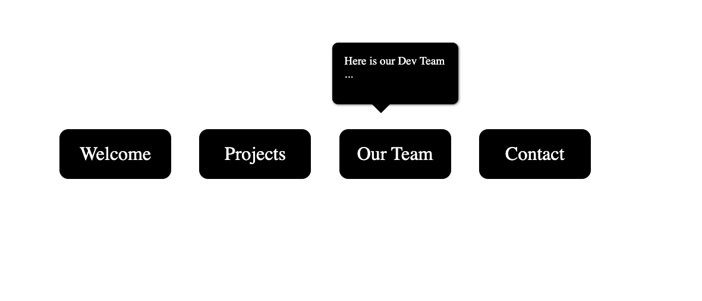

# CSS Only Tooltip UI

> **Project Source**: [Tooltip UI - roadmap.sh](https://roadmap.sh/projects/tooltip-ui)

In this project, you are required to create a tooltip that appears above navigation items when hovered, using only HTML and CSS. A tooltip is a small pop-up box that provides additional information about a navigation item when a user hovers over it. This project will focus on mastering CSS positioning, hover effects, and creating visually appealing tooltips without relying on JavaScript.

The goal of this project is to help you understand how to use CSS for dynamic UI effects. You will learn how to position elements relative to each other, create smooth transitions, and make your navigation more interactive and user-friendly. Below is a rough mockup showing the tooltip appearing above a navigation item.

## Tooltip Mockup

## Features

- **Pure CSS Implementation**: No JavaScript required
- **Hover Effects**: Tooltips appear on hover and disappear when not hovering
- **Smooth Animations**: Includes various animation effects like fade-in, slide-in, or scale-in
- **Responsive Design**: Works across different screen sizes
- **Customizable**: Easy to modify colors, sizes, and animations

## Bonus Features

Bonus points for implementing different animations for the tooltip, such as:
- Fade-in effects
- Slide-in effects
- Scale-in effects
- Custom timing and easing functions

## Learning Objectives

After completing this project, you will have a better understanding of:
- CSS positioning (relative, absolute, fixed)
- CSS hover effects and pseudo-classes
- CSS transitions and animations
- Creating interactive UI elements without JavaScript
- CSS transform properties
- Z-index and layering elements
